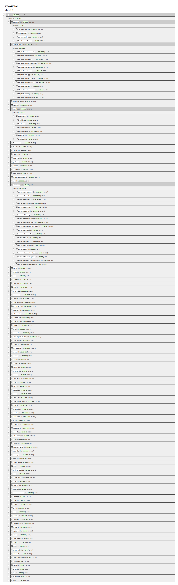

# disk-space-treeviewer
mostra o total de espaço que cada subdiretório de uma pasta possui.

o executavel lê a estrutura de diretórios de uma pasta em específico e exporta um .html onde uma árvore de arquivos pode ser explorada no seu browser.

```
go build .
./main caminho/para/pasta/
```


